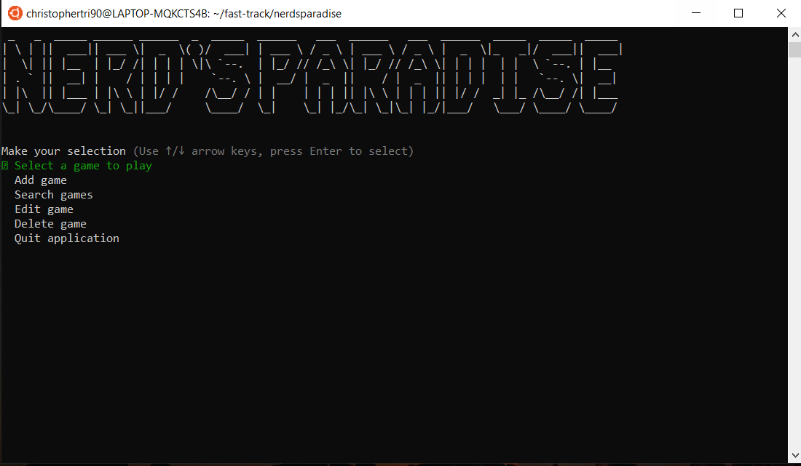
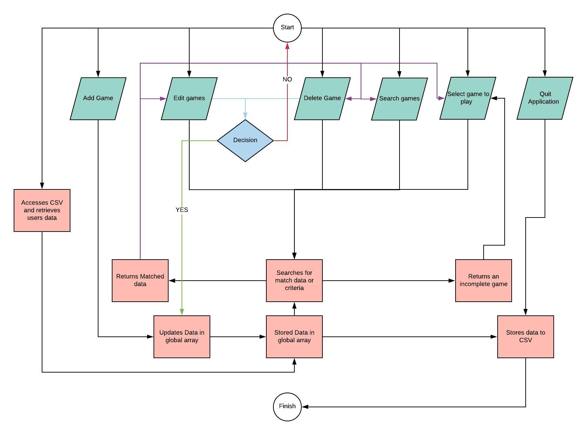
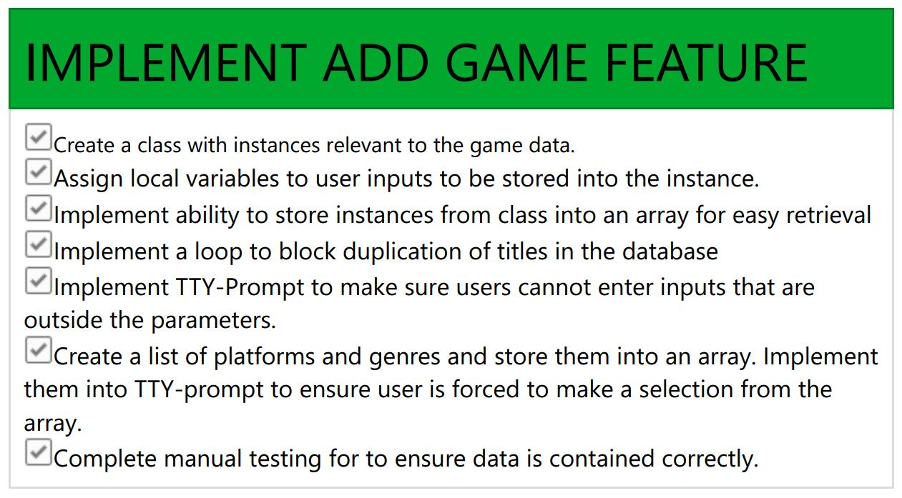
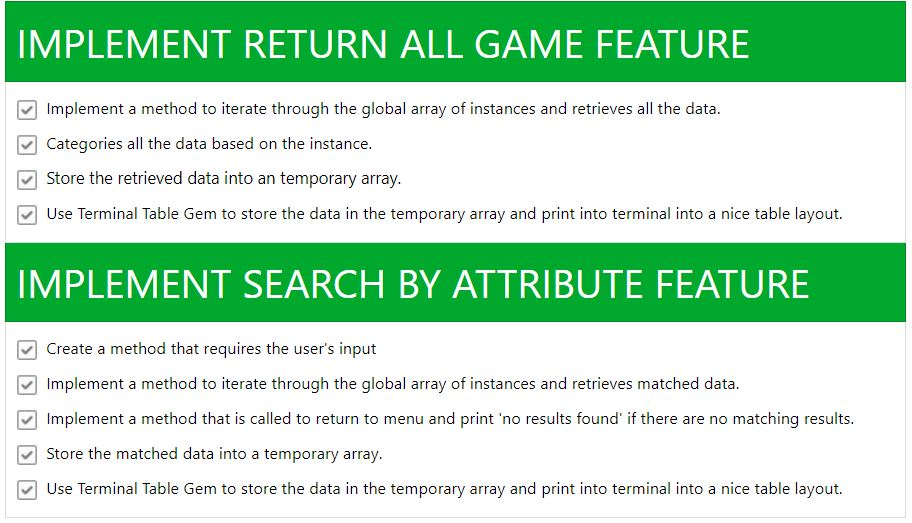
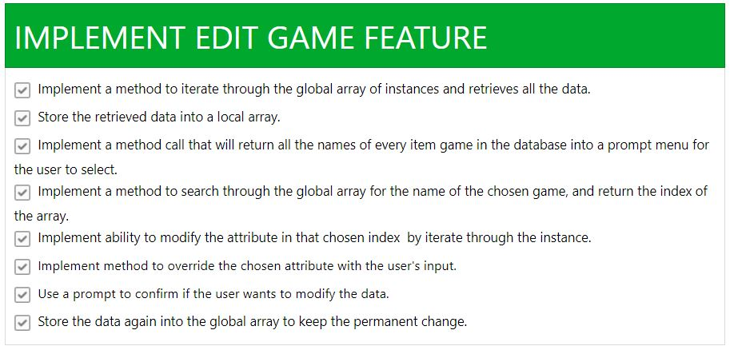
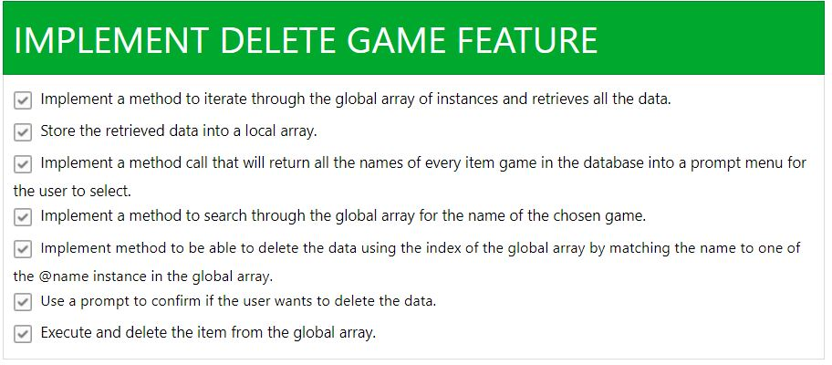
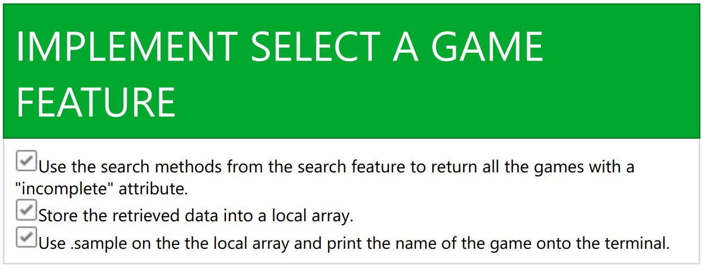

# NERD'S PARADISE


## Purpose

Made for Video gamers and collectors of video games. Nerd's paradise is a simple program that uses using user-friendly interfaces, menus and inputs to allow the users to store individual game details into a local database and view, modify or delete those details. The goal of nerd's paradise is to solves the problem keeping track of all the video games in the user's collection.


## Functionality

The user is prompted to select an option

1. Select a game to play: Randomly selects a video game with an incompleted status in their database and returns the game name for the user to pick and play. 
2. Add game: Allows user to enter the details of their video game to be saved into the database
3. Search games: Presents various options for the user to search their database, including the ability to view all their games, or search based on specific criteria. 
4. Edit game: allows the user to select a game to edit the attribute of the game, which will update in the database. 
5. Delete game: Gives the ability for the user to delete a stored game in the database.

## Dependencies

The Ruby gems 'tty-prompt', 'tty-spinner', 'terminal-table', 'colorize' and 'tty-font' ' are required to run Nerd's paradise

Minimum system requirements: Mac, Windows or Linux

## Instruction for initial install

Download source code and save to preferred directory

In terminal, install the pre-required dependencies with the following code:
````
$ bash build.sh
````

To initialise program:
````
$ ruby app.rb
````
From the main menu, make a section:



## Task Management

Priorities and tasks were managed using a trello board. It allowed me to itemise, breakdown tasks to be systematically completed to meet minimum viable product. 


## Flow Chart




# Implementation Plan

There are 5 features in the application that can be utilise by the user. The implementation process for each are as followed and were implemented based on priority.

The features that were added are:

1. Add game
2. Search game
3. Edit game
4. Delete game
5. Search for a game (to play)

Below details a thorough walkthrough for the implementation for each feature.

### Add game
'Add game' is the most important feature in the system as it allowed the user to enter in the game data into the database. 

The 'add game' feature utilises multiple complex methods that takes the user's input, stores into a local variable and pushes those variables into an instance. Finally the instance is stored into a global array where the other methods and modules can access and manipulate the data.

below is the checklist for the implementation of add game feature. 



### Search game
'Search game' feature was the most complex feature as it was a standalone menu.

This menu was broken up into the following sub-features:

1. List all games: allows the user to print all the individual games in the database onto the terminal. This would use the .each method which iterates through each stored instance in the global array, stored it again into a temporary array. This temporary array is then used by the gem 'terminal-table' which formats it into a readable format.

2. Search by attribute: Allows the user search by attribute and returns all results that match that attribute. To accomplish this, .each method will iterate through each of the instances, and when it finds a match, stores it into a temporary array, which then gets printed out by the end of the method. 




### Edit game
'Edit game' feature allows the user to search through their database and gives the ability to edit a chosen attribute. 

The chosen attribute will then be changed in the instance and then updated in the global array.

The edit game feature uses elements from the search game feature. It will first list all the games in the database by name, and allows the user to pick it to edit. 

Once the user picks a one of the games, it will present the user with a choice for which attribute to edit. This will be accomplished by iterating through the global array, matching the name of the game and editing the chosen attribute. The attribute is updated and re-stored into the global array.



### Delete game
'delete game' feature allows the user to delete a game from their database. 

This will be accomplished by accessing the global array containing all the games in the database. Then to delete the game, the user is presented a list of games using the name, and the user selects the game they want to delete. The input is then translated into an index of the global array and the program will delete that stored data relating to that index. 

There will also need to be a prompt that warns the user that the data is going to be deleted. This is accomplished using tty-prompt.



### Search for a game
'Search for a game' feature allows the user to select an incomplete game and print it to the terminal. 

This is accomplished by extracting the games from the global array with the attribute "incomplete", storing them into a temporary array and using the .sample method to select the game. Finally, it will print the chosen game into the terminal. 




# Help