# NERD'S PARADISE


## Purpose and Scope

The purpose of Nerd's Paradise is to solves the problem of keeping track of all the games inside a user’s personal video game collection. 

The reason why I developed Nerd's paradise is because, as a game collector myself, I have a large game collection and keeping track of all of them can be frustrating. This application fixes that by giving the user the ability to store their personal video game collection into a local database where they can retrieve or modify the data.

The application achieves this by storing data using various ruby functionalities including classes, methods and arrays. The application temporarily stores the data into a global array in the main application file where the user can manipulate the data. When the user exits the application, the data is converted into strings and is stored into a csv. When the user opens the application, it will retrieve the data from the the local csv.

Note: When the documentation mentions database, it's referring to the local csv file.

One major ongoing issue was dealing with the local csv file. If the file is deleted or moved to a different location, the application can't retrieve the data and will instead create a new file inside the local drive. There is a begin and rescue on this to avoid the application from crashing if the file was to be deleted or moved. As all the user's data is stored in the old file, the application can't retrieve the data, and therefore there won't be any data when the application loads. 

As long as the user doesn't delete or move the csv file, the application will continue to run correctly. 

At the current version, there hasn't been a fix yet. However, a future update will solve this issue.


### Target Audience
Nerd's Paradise is designed for video game collectors. 

The application uses a simple menu type interface, where they interact by selecting the function they want to run. Detailed instructions can be found in User Interaction and Experience section below. 

## Features

Currently, this version of Nerd's paradise contains 5 features. 


### Select a game to play 

Randomly selects a video game with an "incomplete" status in their database and prints the name onto the terminal screen.

This feature utilises a conditional statement to determine if a game in the global array has an "incomplete" status. It gets stored into a local array inside the app.rb where a sample method selects a random game and prints the name onto the terminal.


### Add game

Allows user to enter the details of their video game to be saved into the database.

This feature utilises inputs from the user using the tty-prompt gem. Their inputs are stored into a local variable. The initialize method in the class is called and uses the local variables as arguments to store the instance. The instance is pushed into a global array where the data can be manipulated.

Additionally, if the user enters a game into the database that already exists, a conditional statement runs and exits the add game feature back to main menu. It also prompts the user that the game already exists in their database.


### Search games

Presents various options for the user to search their database, including the ability to view all their games, or search based on specific criteria. 

The search feature uses conditional statements and methods to retrieve the game from the database. 

The search menu is split into a sub-menu.

The first item in the sub menu is 'list all games', which iterates through the global array, stores the data into local array and then printed into a readable format using the 'terminal-table' gem. 

The search by attribute displays all games in the database using specific criteria. 
The application iterates through database, returns a list of games titles, and a prompt menu allows the user to either search using the game title or a specific attribute. once the user selects the desired game, a method iterates through the database again, returns all the attributes related to the selected game.


### Edit game

Allows the user to select a game to edit the attribute of the game, which will update in the database. 

This feature is similar to the searched game feature, which utilised a similar method of iterations to return all the games from the database for the user to choose and edit. To allow the user to make edits to the database, local variables were used to store user inputs on attributes that the user wanted.

### Delete game 

Gives the ability for the user to delete a stored game in the database.

This feature used similar iterations, and conditional statements to determine the game the user wanted to delete. It stores all games into a local array where the user can select the game they want to delete. This returns an index of where the game sits in the global array and deletes that index. 


## Dependencies

To run Nerd's paradise, the user needs:


The Ruby gems 'tty-prompt', 'tty-spinner', 'terminal-table', 'colorize' and 'tty-font' ' are required to run Nerd's paradise

## Instruction for install

Download source code and save to preferred directory

In terminal, install the pre-required dependencies with the following code:
````
$ bash build.sh
````

To run application:
````
$ ruby app.rb
````
From the main menu, make a section:

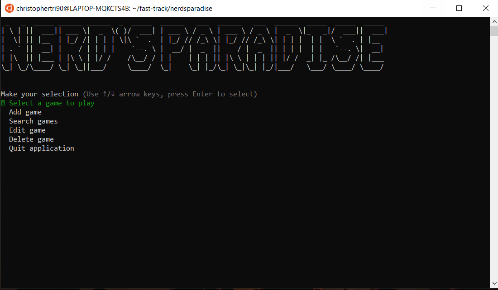

## Task Management

Priorities and tasks were managed using a trello board. It allowed me to itemise, breakdown tasks to be systematically completed to meet minimum viable product. 

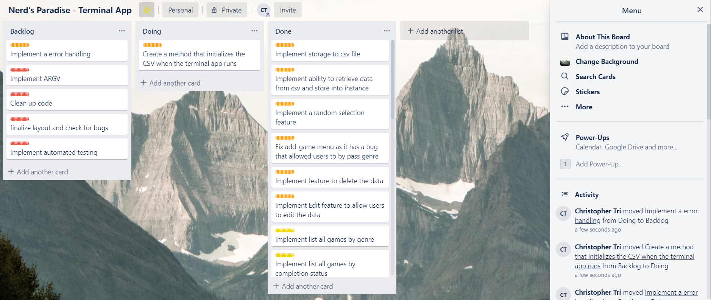

## Flow Chart

Below is a flowchart detailing the processes and its related control flows.

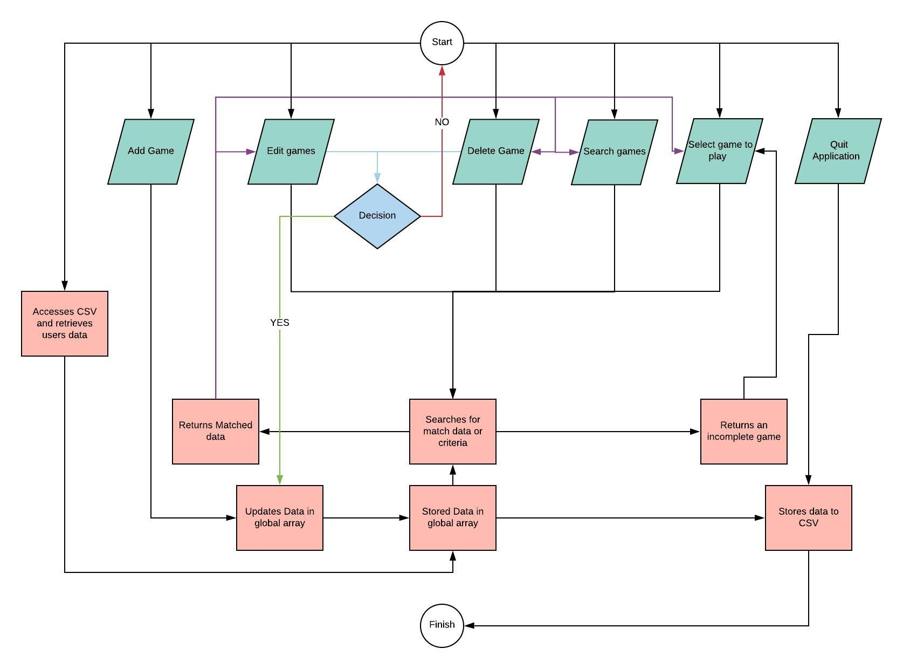


## User Interaction and Experience

Once the user installs the required dependencies, they can run the application using the following in terminal:

Firstly,they will go to the dist folder using the following command in terminal where the application is located:
````
$ cd dist
````
To run the application, in your terminal, type:
````
$ ruby app.rb
````
The main menu should appear.


## Using the application

The user can move up and down the available options in the menu using the up/down arrow keys. To select the option, press Enter.

### 1 - Select a game to play
This option prints a random game that has a status incomplete to terminal for the user to pick and play.

To handle the error where there is no games in the database or all games are marked completed, it prints a message to the user notifying them of that issue. 


### 2 - Adding a game
This option allows the user to enter a new game into the database. 
1. Select the 'Add game' option

2. The user will recieve a prompt asking to confirm they want to add a game.

3. Enter the name of their game.

3. Genre, Platform and Completion Status have similar menu layouts. This will be a menu that can be navigated using the up/down arrow keys. Select using the Enter key.

An error that occurred was if the user enters something that could not be accepted by the the instance (e.g. strings instead of boolean values). This is accomplished by presenting the user with predetermined options, hence avoiding the possibility of the user entering data that could break the application.

### 3 - Search games
This option will allow the user to search and return the list of games using a selected criteria.

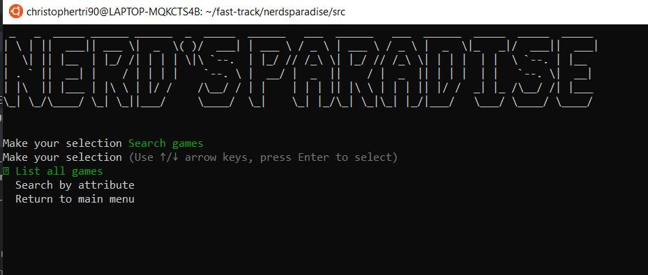

1. To display all games in the database, select the 'list all games'. Games will print onto the terminal. 

2. If the user want to search for specific games in the database or list by attributes, they can use the 'search by attribute' feature.

They'll be presented with the following options: 

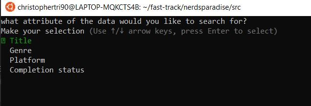

If search by Title is chosen, a screen will be presented to them to enter the name of the game being searched. 

The other options in the search by attribute menu is guided by prompts. Use the up/down arrow keys to navigate and the Enter key to select the option.

If the game exists in the database, it will print on the screen. If the game(s) doesn't exist in the database it will return 'no results found!'

One error that occurred, was the application would break if there was no results found from the search. This was handled by implementing a method containing a conditional statement that determines if no results were found, prompts the user, and loops them back to the main menu.

### 4 - Edit game
This option allows the user to edit an attribute of their game in the database. 

1. Select a game the user wants to edit. 
2. Select the attribute the user wants to edit.
3. They'll be prompted to confirm if they want to save the changes. 
4. It will notify them that the game's attribute has been changed successfully. 

The possible error that could have occurred was if the user entered an argument that was not correct (e.g. entering a string when it should be a boolean). To handle this,the options were set out in a predetermined menu that allowed a user to select the option rather than having them manually enter it.

### 5 - Delete game
This option allows the user to delete a game from the database.

1. Select the game the user wants to delete
2. They'll be prompted to confirm if they want to delete the file. 
3. If yes is selected, the game will be deleted.

In order to avoid the user from trying to search for a game that may not exist in the database, a method was used where the title of the games were retrieved and presented in a menu. The user then selects the game they want to delete.

## Adding a new game or displaying all games outside of the application.

This feature allows a user to add a game or display all games in the database outside the application.

1. To display all games outside the application enter the following in terminal:

````
$ ruby app.rb display
````

2. If they want to add a game to the database outside the application, enter the following in terminal:

````
$ruby app.rb add <name of game>
````


# Implementation Plan

There are 5 features in the application that can be utilise by the user. The implementation process for each are as follows and were implemented based on priority.

The features that were added are:

1. Add game
2. Search game
3. Edit game
4. Delete game
5. Search for a game (to play)

Below details a thorough walkthrough for the implementation for each feature.

### Add game
'Add game' is the most important feature in the system as it allows the user to enter in the game data into the database. 

The 'add game' feature utilises multiple complex methods that takes the user's input, stores into a local variable and pushes those variables into an instance. Finally, the instance is stored into a global array where the other methods and modules can access and manipulate the data.

Below is the checklist for the implementation of add game feature. 

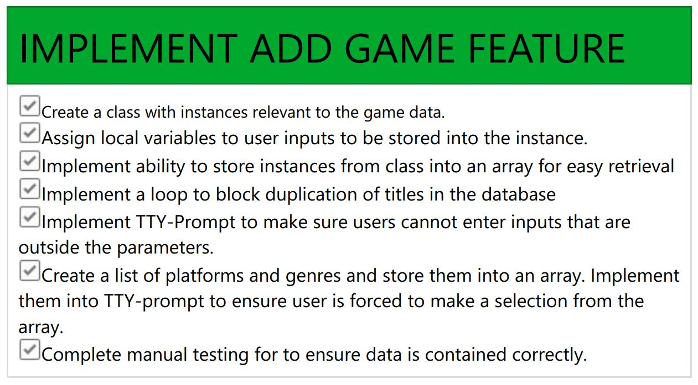

### Search game
'Search game' feature was the most complex feature as it was a standalone menu.

This menu was broken up into the following sub-features:

1. List all games: allows the user to print all the individual games in the database onto the terminal. This would use the .each method which iterates through each stored instance in the global array, and stored again into a temporary array. This temporary array is then used by the gem 'terminal-table' which formats it into a readable format.

2. Search by attribute: Allows the user search by attribute and returns all results that match that attribute. To accomplish this, .each method will iterate through each of the instances, and when it finds a match, stores it into a temporary array, which then gets printed out by the end of the method. 

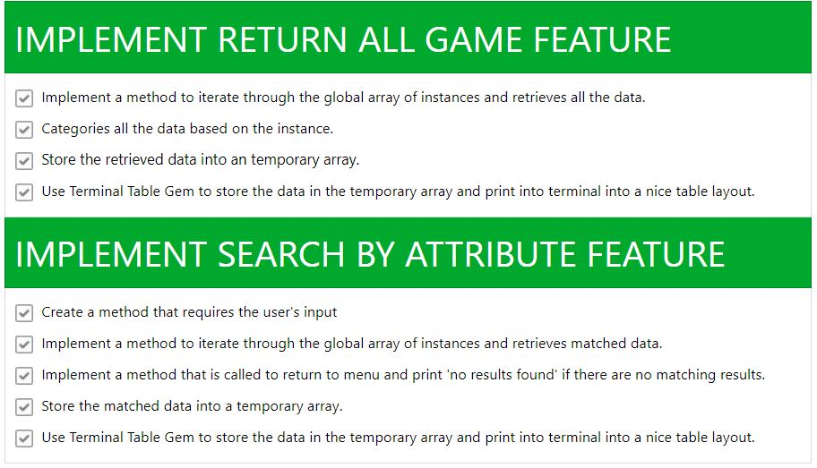


### Edit game
'Edit game' feature allows the user to search through their database and gives the ability to edit a chosen attribute. 

The chosen attribute will then be changed in the instance and then updated in the global array.

The edit game feature uses elements from the search game feature. It will first list all the games in the database by name, and allows the user to pick it to edit. 

Once the user picks one of the games, it will present the user with a choice for which attribute to edit. This will be accomplished by iterating through the global array, matching the name of the game and editing the chosen attribute. The attribute is updated and re-stored into the global array.

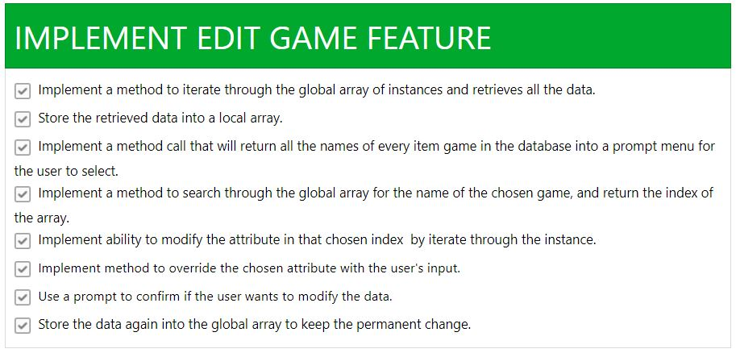

### Delete game
'Delete game' feature allows the user to delete a game from their database. 

This will be accomplished by accessing the global array containing all the games in the database. Then to delete the game, the user is presented a list of games using the name, and the user selects the game they want to delete. The input is then translated into an index of the global array and the application will delete that stored data relating to that index. 

A prompt is needed to warn the user that the data is going to be deleted. This is accomplished using tty-prompt.


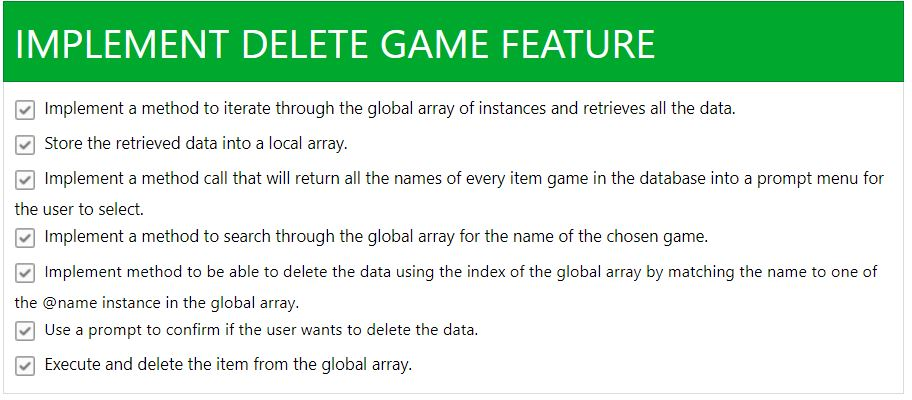

### Search for a game
'Search for a game' feature allows the user to select an incomplete game and prints it to the terminal. 

This is accomplished by extracting the games from the global array with the attribute "incomplete", storing them into a temporary array and using the .sample method to select the game. Finally, it will print the chosen game into the terminal. 

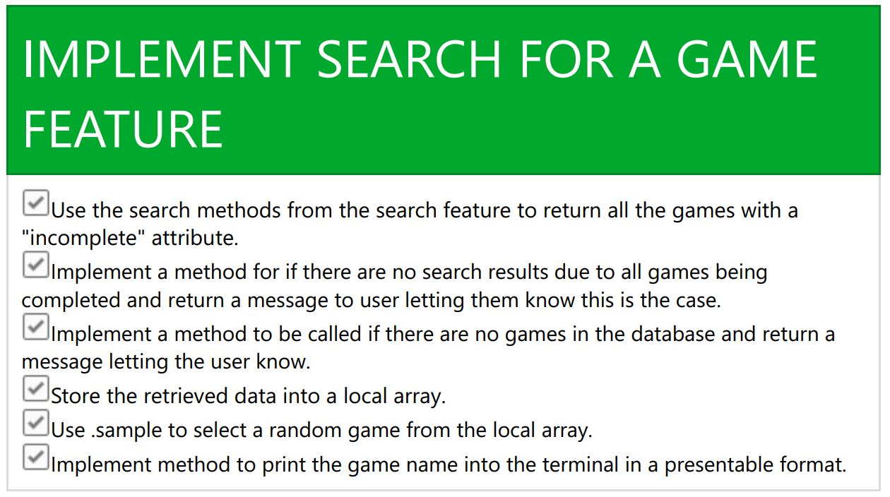


# Testing

Automated testing was implemented to test two features. 

The two features that were tested was the add game feature and delete game feature. 

In order to test these features, a dummy database (global array) was created in the test.rb file and the add_game and delete_game methods were called from the module.rb file. 

A test case was written for each to test if the add_game feature worked. The expected result if the test passed was if the empty dummy database contained data after it was passed through the the add_game method.

````ruby
def test_add_game(array_test)
  if array_test.length == 1
    # this should push an item into the array if it works correctly.
    puts 'Test has passed'.colorize(:green)
  else
    puts 'Test has failed'.colorize(:red)
  end
end
````
Finally, using the same dummy database with a single element created using the add_game method, tested the ability to delete data from the database. The delete_game method was called and the dummy database passed through the method. If the test was successful, the dummy database would contain no data.

````ruby
def test_delete_game(array_test)
  if array_test.empty?
    # This should remove the data from the array.
    puts 'Test has passed'.colorize(:green)
  else
    puts 'Test has failed'.colorize(:red)
  end
end
````

Here were the results. 

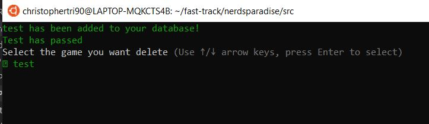

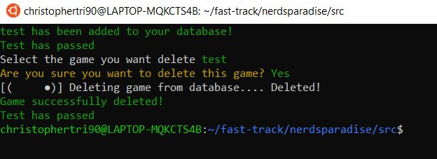


Both tests passed, meaning both features were working as intended. 

# Help

This section wil explain how to install the necessary dependencies and how to use the application itself.

## Minimum requirements
* PC, MAC or Linux system. 

* System terminal to run and install the application. 

* You'll need ruby 2.5.1 to run the application.

## Clone the repository

````
git clone https://github.com/MomentaiChris26/nerdsparadise.git

````

## Installing necessary dependencies
To ensure your machine has the necessary dependencies to run the application, you'll need to run the build.sh in your terminal. Use the following command in the terminal to install the necessary dependencies.

````
$ bash build.sh
````

## Running the application
Firstly, go to the dist folder using the following command in the terminal where the application is located:

````
cd dist
````

To run the application, in your terminal, type:
````
$ ruby app.rb
````

If the application runs correctly, you'll see the following screen will appear on your terminal.


## Menu options

### Select a game to play 
Randomly selects a video game with an incomplete status in their database and returns the game name for the user to pick and play.

### Add game
Allows user to enter the details of their video game to be saved into the database.

### Search game
Allows the user to search for a game in their database using specific criterias.

### Edit game
Allows the user to select a game to edit the attribute of the game, which will update in the database.
 
### Delete game 
Gives the ability for the user to delete a stored game in the database.

