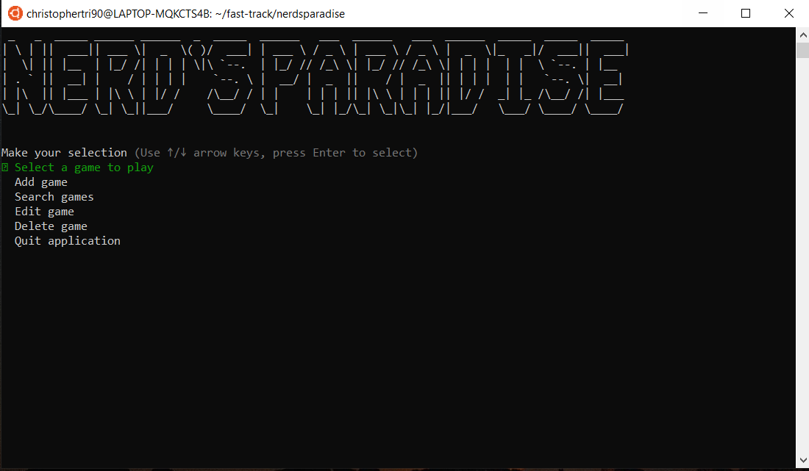

# NERD'S PARADISE


## Purpose

Made for Video gamers and collectors of video games. Nerd's paradise is a simple program that uses using user-friendly interfaces, menus and inputs to allow the users to store individual game details into a local database and view, modify or delete those details. The goal of nerd's paradise is to solves the problem keeping track of all the video games in the user's collection.


## Functionality

The user is prompted to select an option

1. Select a game to play: Randomly selects a video game with an incompleted status in their database and returns the game name for the user to pick and play. 
2. Add game: Allows user to enter the details of their video game to be saved into the database
3. Search games: Presents various options for the user to search their database, including the ability to view all their games, or search based on specific criteria. 
4. Edit game: allows the user to select a game to edit the attribute of the game, which will update in the database. 
5. Delete game: Gives the ability for the user to delete a stored game in the database.

## Dependencies

The Ruby gems 'tty-prompt', 'tty-spinner', 'terminal-table', 'colorize' and 'tty-font' ' are required to run Nerd's paradise

Minimum system requirements: Mac, Windows or Linux

## Instruction for use

Download source code and save to preferred directory

In terminal, install the pre-required dependencies with the following code:
````
$ bash build.sh
````

To initialise program:
````
$ ruby app.rb
````
From the main menu, make a section:



## Task Management

Priorities and tasks were managed using a trello board. It allowed me to itemise, breakdown tasks to be systematically completed to meet minimum viable product. 


